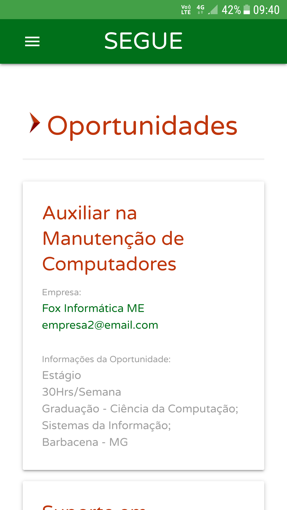

    

**1. Objetivo**

Criar a plataforma SEGUE - Sistema Estratégico de Gestão Unificada de Egressos do IF Sudeste MG com vistas a efetivar a política de acompanhamento de egressos, bem como possibilitar pesquisas e dados sobre os diversos cursos, especialmente no que tange às exigências do mercado de trabalho, além de concretização de elo Instituição/Setor produtivo, por meio do uso de tecnologia.

    <strong>Cadastro do Currículo<strong>
    

Oportunidades              |  Questionários
:-------------------------:|:-------------------------:
  |  

